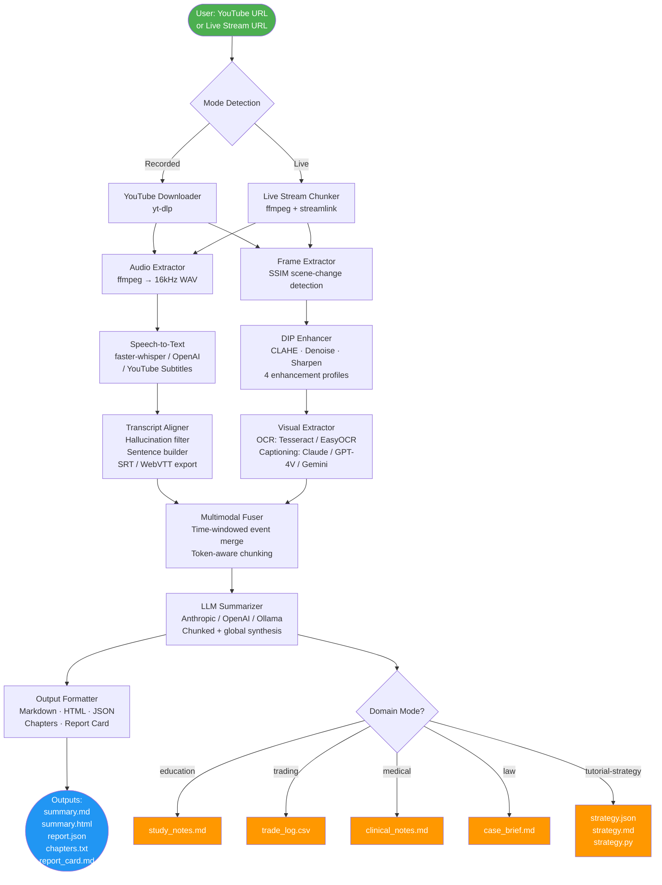
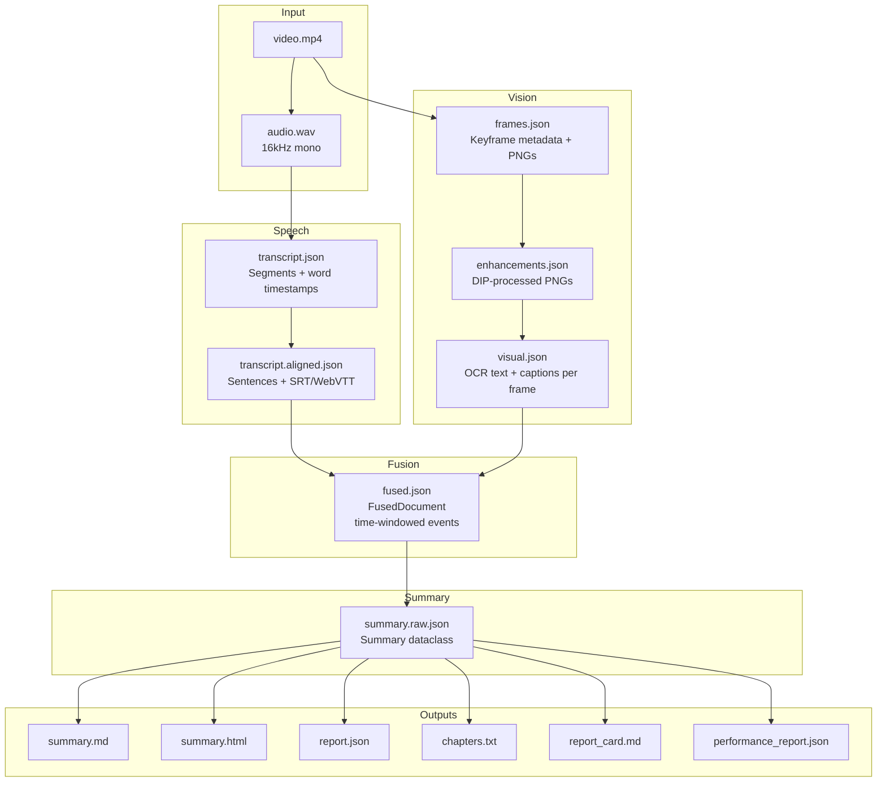
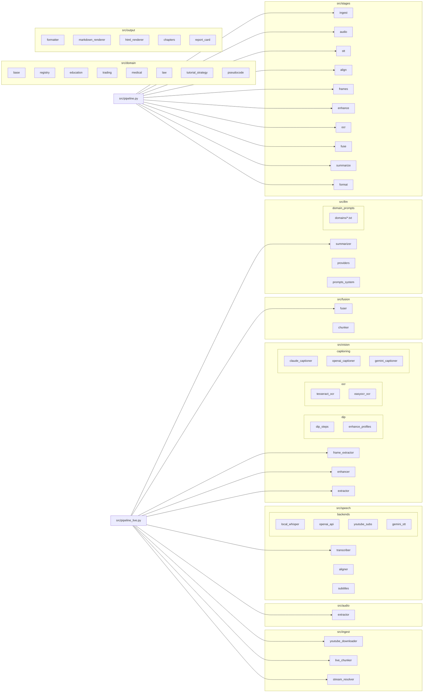

# Plan 6.4 — Architecture Design Document & Diagram

> **Self-contained scope.** Produce the Architecture Design deliverable required by the PRD. This includes: a formal architecture document (`docs/architecture.md`), a system diagram in Mermaid notation (renderable to PNG/SVG via CLI), and a concise component reference. No new source code is written.

---

## 1. Objective

Produce the following files:
1. `docs/architecture.md` — full architecture document (system overview, component descriptions, data flow, design decisions).
2. `docs/diagrams/system_overview.mmd` — Mermaid flowchart of the entire pipeline.
3. `docs/diagrams/live_pipeline.mmd` — Mermaid diagram of the live-stream sub-pipeline.
4. `docs/diagrams/data_flow.mmd` — Mermaid diagram showing data transformations between stages.
5. `docs/diagrams/component_map.mmd` — Mermaid class/component diagram of source modules.
6. `docs/diagrams/*.png` — rasterized exports of all diagrams (for submission PDFs).

---

## 2. Diagram Tool

Use **Mermaid** syntax. Diagrams can be rendered:
- Online: paste `.mmd` content into https://mermaid.live
- CLI: `npx @mermaid-js/mermaid-cli -i file.mmd -o file.png` (requires Node.js)
- VS Code: Mermaid Preview extension
- Python: `pip install mermaid-py` then `mermaid.render()`

---

## 3. System Overview Diagram (`system_overview.mmd`)



---

## 4. Live Pipeline Diagram (`live_pipeline.mmd`)

```mermaid
flowchart LR
    A([Live Stream URL]) --> B[Stream Resolver\nstreamlink + yt-dlp]
    B --> C[ffmpeg Chunker\n10-second rolling chunks]
    C --> D[Chunk Queue\nThread-safe]

    D --> E[Audio Extraction\nper chunk]
    E --> F[faster-whisper\nnear real-time STT]
    F --> F2[Transcript Aligner]

    D --> G[Frame Extraction\nSSIM per chunk]
    G --> H[DIP Enhancement]
    H --> I[OCR / Caption\nper chunk]

    F2 --> J[Event Fuser\nappend to fused.json]
    I --> J

    J --> K{Every 30s?}
    K -->|Yes| L[Rolling Summarizer\nClaude / GPT]
    L --> M[rolling_summary.json]
    M --> N[Streamlit UI Poller\n3-second refresh]

    K -->|No| J

    O([Stop Signal]) --> C

    style A fill:#4CAF50,color:#fff
    style M fill:#2196F3,color:#fff
    style N fill:#9C27B0,color:#fff
```



---

## 5. Data Flow Diagram (`data_flow.mmd`)



---

## 6. Component Map (`component_map.mmd`)



---

## 7. Architecture Document (`docs/architecture.md`)

The full document should contain the following sections. Each is described below:

### Section 1: System Overview
- Purpose and scope.
- High-level description: "This system processes live and recorded online videos by combining ASR, computer vision (DIP), and LLM-based multimodal reasoning to produce structured summaries."
- Technology stack table (Python, libraries, AI APIs).

### Section 2: Module Descriptions
For each of the 8 source modules (`ingest`, `audio`, `speech`, `vision`, `fusion`, `llm`, `output`, `domain`):
- Purpose (one paragraph).
- Key files and their roles.
- Inputs and outputs (file paths and formats).

### Section 3: Pipeline Stages
Table of all 10 stages:

| Stage | Module | Input | Output | Notes |
|-------|--------|-------|--------|-------|
| ingest | src/ingest | URL | video.mp4 | yt-dlp or ffmpeg capture |
| audio | src/audio | video.mp4 | audio.wav | 16kHz mono for ASR |
| stt | src/speech | audio.wav or URL | transcript.json | 4 backends |
| align | src/speech | transcript.json | transcript.aligned.json | hallucination filter |
| frames | src/vision | video.mp4 | frames.json + PNGs | SSIM scene detection |
| enhance | src/vision | frames.json | enhancements.json | DIP profiles |
| ocr | src/vision | enhancements.json | visual.json | Tesseract/EasyOCR |
| fuse | src/fusion | aligned transcript + visual | fused.json | time-windowed events |
| summarize | src/llm | fused.json | summary.raw.json | chunked LLM calls |
| format | src/output | summary.raw.json | summary.md, .html, .json | multi-format render |

### Section 4: Live vs Recorded Pipeline
- Differences between the two modes.
- Diagram: live pipeline (see §4 above).
- Rolling summary mechanism.

### Section 5: DIP (Digital Image Processing) Pipeline
Detailed section because this is a DIP project:
- Keyframe extraction: SSIM-based frame differencing. Threshold configurable. Min gap between frames.
- Enhancement profiles: table of 4 profiles (default, screen, whiteboard, scene) with their DIP operation chains.
- DIP operations used: Gaussian denoise, bilateral filter, CLAHE, sharpening kernel, adaptive threshold, Otsu binarization, morphological erosion/dilation, deskew (Hough transform).
- Why each operation improves OCR accuracy.
- Include before/after frame comparison (use actual demo frames if available).

### Section 6: Speech Understanding
- ASR backend selection logic.
- Hallucination filtering heuristics (list patterns).
- Sentence boundary detection.
- Forced alignment (optional wav2vec2).
- Output: SRT and WebVTT subtitle files.

### Section 7: Multimodal Fusion
- FusedEvent schema.
- Time-windowing logic (how speech and visual events at similar timestamps are merged).
- Token-aware chunking for LLM context management.

### Section 8: LLM Summarization
- Two-pass architecture (chunk summary → global synthesis).
- Prompt engineering decisions.
- Domain-specific addenda mechanism.
- Provider comparison table (Claude, GPT, Ollama).

### Section 9: Domain-Specific Analysis
- Table of 5 domain profiles.
- For each: extra extracted fields, extra output files, disclaimers.
- Tutorial-strategy pseudocode generation algorithm.

### Section 10: Design Decisions & Trade-offs
For each key decision, document "Decision / Alternative / Why chosen":

| Decision | Alternative considered | Reason chosen |
|----------|----------------------|---------------|
| faster-whisper as default STT | OpenAI Whisper API | No API cost; runs offline; comparable accuracy |
| SSIM for keyframe detection | Fixed-interval sampling | Adapts to content; skips static frames |
| Two-pass LLM summarization | Single long-context call | More reliable structured output; allows per-chunk validation |
| Streamlit for UI | Flask + React | Fast prototyping; no frontend build step |
| Mermaid for diagrams | draw.io / Lucidchart | Text-based; version-controllable; renderable in CI |

### Section 11: Performance Characteristics
- Table of expected processing times per stage (from actual demo run).
- Token usage breakdown.
- Memory footprint estimates.

### Section 12: Limitations & Future Work
- Speaker diarization not implemented.
- Live mode latency (~10–30s chunk lag).
- No video content moderation.
- Potential improvements: WebSocket-based live UI, multilingual support, RAG-based Q&A.

---

## 8. Files to Create

```
docs/
  architecture.md
  diagrams/
    system_overview.mmd
    live_pipeline.mmd
    data_flow.mmd
    component_map.mmd
    system_overview.png      (rendered from .mmd)
    live_pipeline.png
    data_flow.png
    component_map.png
```

---

## 9. Rendering Diagrams to PNG

```bash
# Install Mermaid CLI (requires Node.js)
npm install -g @mermaid-js/mermaid-cli

# Render all diagrams
for f in docs/diagrams/*.mmd; do
    mmdc -i "$f" -o "${f%.mmd}.png" -b white -w 1600
done
```

Alternatively, paste each `.mmd` file into https://mermaid.live and export as PNG.

---

## 10. Phased Execution

| Phase | Task | Effort |
|-------|------|--------|
| A | Create `docs/diagrams/` directory and write all 4 `.mmd` files | 45 min |
| B | Render `.mmd` → `.png` (CLI or mermaid.live) | 20 min |
| C | Write `docs/architecture.md` sections 1–6 | 2 hr |
| D | Write sections 7–12 (using actual demo run data from Plan 6.3) | 1.5 hr |
| E | Review and proofread; insert actual frame screenshots | 30 min |

**Total estimated effort: ~5 hours**

---

## 11. Acceptance Criteria

- [ ] `docs/architecture.md` exists and covers all 12 sections listed above.
- [ ] All 4 Mermaid diagram files exist in `docs/diagrams/`.
- [ ] All 4 PNG exports exist in `docs/diagrams/`.
- [ ] Pipeline stage table in Section 3 is accurate and complete.
- [ ] DIP section (§5) describes all DIP operations actually used in `src/vision/dip_steps.py`.
- [ ] Design decisions table (§10) has at least 5 entries with rationale.

---

## 12. Definition of Done

A reviewer can open `docs/architecture.md`, read a complete description of every component, view the pipeline diagrams as embedded images, and understand the system's design decisions — without reading any source code.
